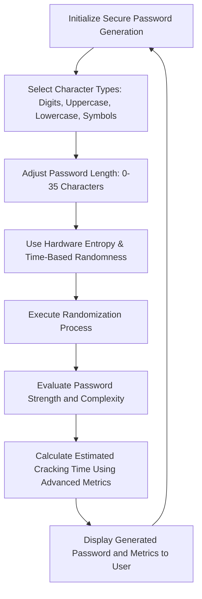

# Password Generator

This is a feature-rich password generator application developed using the Qt framework. It provides a user-friendly graphical interface that allows users to generate strong, random passwords based on customizable settings. With support for multiple character types, randomness sources, and password length adjustments, this application ensures the creation of highly secure passwords.


## Screenshots:


## Key Features:

- **Character Type Selection**: 
  - Numbers: Random digits from 0 to 9.
  - Lowercase Alphabets: Random characters from 'a' to 'z'.
  - Uppercase Alphabets: Random characters from 'A' to 'Z'.
  - Symbols: A variety of special characters, including `!`, `@`, `#`, `$`, and more.

- **Randomness Sources**: 
  - **Hardware Randomness**: Uses system hardware entropy (random device).
  - **Time-based Randomness**: Seeds with the current system time.
  
- **Password Length Adjustment**: Adjust password length using a slider (0 to 35 characters).

- **Password Strength Indicator**: Displays a color-coded strength indicator based on password length (Red = Weak, Green = Strong).

- **Clipboard Copy**: One-click copy of the generated password.

- **Password Cracking Estimation**: Calculates how long it would take to crack the password, based on its complexity.

- **Dynamic Feedback**: Updates password and cracking time in real-time as settings are adjusted.


## Graph



## Example Output:

After generating a password, the application might display something like this:

- **Generated Password**: `A5t!9oX$1`
- **Strength Indicator**: Green (Strong)
- **Cracking Time**: 3 hours


## Installation Instructions:

1. **Clone the Repository**:  
   To get started, clone the repository to your local machine:
   ```bash
   git clone https://github.com/AmoghRaina/PasswordGenerator.git


## Contributing:

Feel free to fork this repository, submit issues, or make pull requests if you'd like to contribute to the project.


## License:

This project is open-source under the MIT License.

## Future Features:
- Password history to track previously generated passwords
- Option to save and export passwords to a file
- Additional character customization (e.g., avoiding ambiguous characters)
- Multi-language support for the UI


